# Reflection Tree Architecture Diagram

This diagram maps the flow of the deterministic state machine. It uses a Directed Acyclic Graph (DAG) pattern to provide personalized reflection feedback before converging back to the main path, preventing node explosion.

```mermaid
graph TD
    %% AXIS 1: LOCUS
    N1([1. Start]) --> N2[2. Q: Assessment of daily rhythm]
    N2 --> N3{3. Decision}
    N3 -- Victim --> N4[4. Reflect: External friction]
    N3 -- Victor --> N5[5. Reflect: Intentional momentum]
    N3 -- Situational --> N6[6. Q: Reaction to obstacles]
    
    N4 --> N6
    N5 --> N6
    N6 --> N7{7. Decision}
    N7 -- Victim --> N8[8. Reflect: Mourning the plan]
    N7 -- Victor --> N9[9. Reflect: Immediate resolution]
    N8 --> N10([10. Bridge: To Axis 2])
    N9 --> N10

    %% AXIS 2: ORIENTATION
    N10 --> N11[11. Q: Primary collaboration focus]
    N11 --> N12{12. Decision}
    N12 -- Entitlement --> N13[13. Reflect: Prioritizing momentum]
    N12 -- Contribution --> N14[14. Reflect: Surplus mindset]
    N12 -- Balanced --> N15[15. Q: Contextualizing requests]
    
    N13 --> N15
    N14 --> N15
    N15 --> N16{16. Decision}
    N16 -- Entitlement --> N17[17. Reflect: Bandwidth boundaries]
    N16 -- Contribution --> N18[18. Reflect: Obligation to connection]
    N17 --> N19[19. Q: Need for acknowledgment]
    N18 --> N19
    N19 --> N20{20. Decision}
    N20 -- Entitlement --> N21[21. Reflect: External validation]
    N20 -- Contribution --> N22[22. Reflect: Self-sustaining loop]
    N21 --> N23([23. Bridge: To Axis 3])
    N22 --> N23

    %% AXIS 3: RADIUS
    N23 --> N24[24. Q: Trade-off anchors]
    N24 --> N25{25. Decision}
    N25 -- Self --> N26[26. Reflect: Protecting the system]
    N25 -- Others --> N27[27. Reflect: Sociocentric thinking]
    N25 -- Balanced --> N28[28. Reflect: Ecosystem tension]
    
    N26 --> N29[29. Q: Architecture of success]
    N27 --> N29
    N28 --> N29
    N29 --> N30{30. Decision}
    N30 -- Self --> N31[31. Reflect: Invisible support web]
    N30 -- Others --> N32[32. Reflect: System orchestration]
    N31 --> N33[33. Q: Framing interruptions]
    N32 --> N33
    N33 --> N34{34. Decision}
    N34 -- Self --> N35[35. Reflect: Connective tissue]
    N34 -- Others --> N36[36. Reflect: Team enabler]
    N35 --> N37[37. Narrative Interpolation Summary]
    N36 --> N37
    
    %% TERMINATION
    N37 --> N38([38. End])

    %% Styling
    classDef startEnd fill:#d4edda,stroke:#28a745,stroke-width:2px,color:#000000;
    classDef question fill:#cce5ff,stroke:#007bff,stroke-width:2px,color:#000000;
    classDef decision fill:#fff3cd,stroke:#ffc107,stroke-width:2px,color:#000000;
    classDef reflection fill:#e2e3e5,stroke:#6c757d,stroke-width:2px,color:#000000;
    classDef bridge fill:#d1ecf1,stroke:#17a2b8,stroke-width:2px,color:#000000;

    class N1,N38 startEnd;
    class N2,N6,N11,N15,N19,N24,N29,N33 question;
    class N3,N7,N12,N16,N20,N25,N30,N34 decision;
    class N4,N5,N8,N9,N13,N14,N17,N18,N21,N22,N26,N27,N28,N31,N32,N35,N36 reflection;
    class N10,N23 bridge;
```

